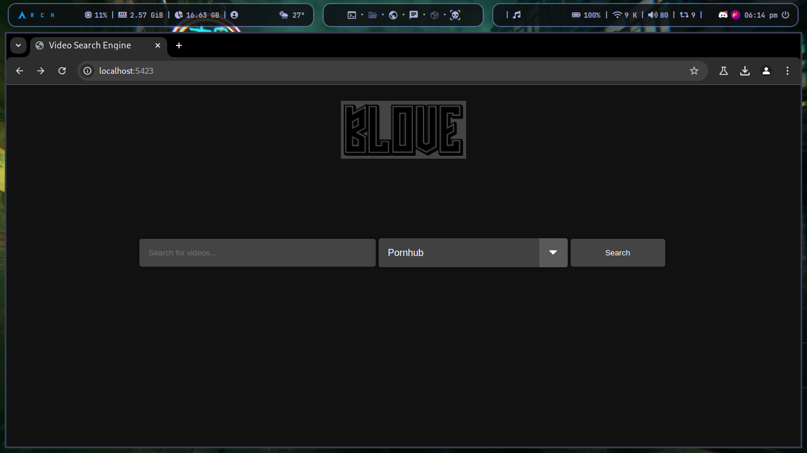
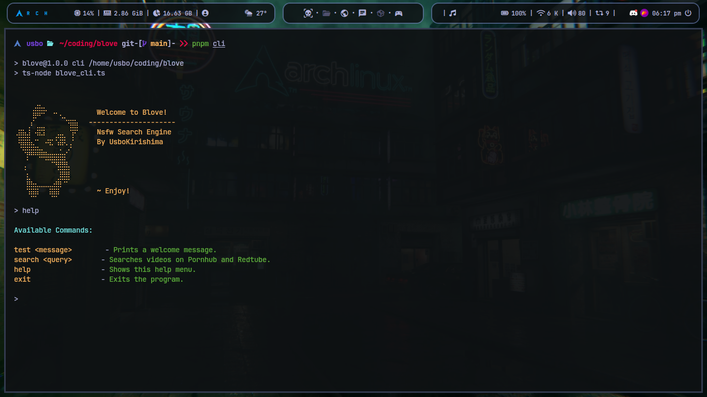

# Blove: NSFW Search Engine


Welcome to Blove, your NSFW search engine! Blove allows you to search for adult videos using various providers and view the results both through a web client and a command-line interface (CLI).

## Table of Contents

- [Features](#features)
- [Getting Started](#getting-started)
- [Using the Web Client](#using-the-web-client)
- [Using the CLI](#using-the-cli)
- [License](#license)

## Features

- **Search for videos**: Use popular adult video providers like Pornhub and Redtube.
- **Web Interface**: View search results in a stylish web interface.
- **CLI Interface**: Access search functionality directly from the command line.

## Getting Started

Follow these instructions to get Blove up and running on your local machine.

### Prerequisites

Ensure you have the following installed:

- [Node.js](https://nodejs.org/) (v14.x or later)
- [pnpm](https://pnpm.io/) (Package Manager)

### Installation

1. Clone the repository:

    ```bash
    git clone https://github.com/UsboKirishima/blove
    ```

2. Navigate to the project directory:

    ```bash
    cd blove
    ```

3. Install dependencies:

    ```bash
    pnpm install
    ```

## Using the Web Client

To start the web client:

1. Run the following command:

    ```bash
    pnpm start
    ```

2. Open your browser and visit [http://localhost:5423](http://localhost:5423).

### Web Client Features

- **Search for Videos**: Enter search queries and view results in a grid layout.
- **Clickable Cards**: Each video card is clickable and will open the video in a new tab.



## Using the CLI

To use the command-line interface (CLI):

1. Run the CLI with the following command:

    ```bash
    pnpm cli
    ```

2. Follow the prompts to enter search queries and view results directly in the terminal.



### CLI Features

- **Help Command**: Type `help` to list all commands.
- **Search Command**: Type `search [query]` to perform a video search.
- **Test Command**: Type `test [message]` to test the command handler.

## License

This project is licensed under the GNU GENERAL PUBLIC LICENSE - see the [LICENSE](./LICENSE) file for details.
